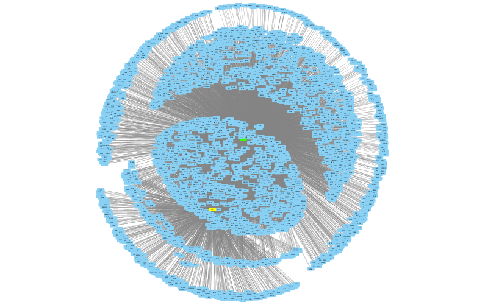

```{r setup, include=FALSE}
knitr::opts_chunk$set(echo = T, warning = F, message = F, cache = T)
```

## Read Data

Description       | Temperature | Time(s)
----------------- | ----------- | --------------
Reference         | 25°C        | 0 min
Mild heat shock   | 37°C        | 10 min, 30 min
Severe heat shock | 42°C        | 10 min, 30 min

Yeast types:

* Reference/Wildtype
* Knockdown: HSF1
* Knockout: MSN2/4
* Knockdown & Knockout: HSF1 and MSN2/4 (double)

$\implies$ 3 replicates of each condition


```{r}
library(tidyverse)

# read each file
complex_yeast_heatshock <- read_tsv("complex_yeast_heatshock.tsv")
sample_mapping <- read_tsv("sample_mapping.tsv")
flat_file <- read_tsv("yeastract2019-flat-file.tsv", col_names = F, na = c("", "NA", "N/A"))

# set column names for flat_file
names(flat_file) <- c("Regulator_systematic", "Regulator_standard",
                      "Target_systematic", "Target_standard",
                      "Id", "Date", "Environment", "Regulation", "Type", "Method")
```

## Get to know the data

First of all, we looked at the data including the mapping in order to get a basic understanding of the data.

### Difference between KO and KD 

> "The **key difference** between gene knockout and knockdown is that the **gene knockout is a technique where the gene of interest is completely removed (inoperative state)** to study of functions of the gene while **gene knockdown is another technique where the gene of interest is silenced** to investigate the role of the particular gene in a biological system."  
---[Difference Between Gene Knockout and Knockdown | Compare the Difference Between Similar Terms](https://www.differencebetween.com/difference-between-gene-knockout-and-knockdown/)

### Observations on our data

* MSN2/4 is always KO
* HSF1 is always KD
* Wildtype $\to$ without any KO/KD
* Double $\to$ MSN2/4 & HSF1 both KO/KD
* Temperature in °C 
* For each condition and strain: 3 replicates
* 25°C / 37°C / 42°C after certain times (0 min for 25°C; 10/30 min for heatshock)
* Gene expression data for each gene
* Flat file for interactions

### Get an impression of HSF1 and MSN2/4

#### HSF1

> "Trimeric heat shock transcription factor;
> activates multiple genes in response to highly diverse stresses and transient intracellular acidification;
> recognizes variable heat shock elements (HSEs) consisting of inverted NGAAN repeats;
> monitors translational status of cell through an RQC (Ribosomal Quality Control)-mediated translation-stress signal;
> involved in diauxic shift;
> posttranslationally regulated;
> human homolog HSF1 with linker region mutations can complement yeast hsf1 mutant" \
---[Description of HSF1 / YGL073W | SGD](https://www.yeastgenome.org/locus/S000003041)

#### MSN2 

> "Stress-responsive transcriptional activator;
> activated in stochastic pulses of nuclear localization in response to various stress conditions;
> binds DNA at stress response elements of responsive genes;
> light sensing pathway component that accumulates in the nucleus in response to blue light;
> relative distribution to nucleus increases upon DNA replication stress" \
---[Description of MSN2 / YMR037C | SGD](https://www.yeastgenome.org/locus/S000004640)

#### MSN4

> "Stress-responsive transcriptional activator;
> activated in stochastic pulses of nuclear localization in response to various stress conditions;
> binds DNA at stress response elements of responsive genes, inducing gene expression;
> involved in diauxic shift" \
---[Description of MSN4 / YKL062W | SGD](https://www.yeastgenome.org/locus/S000001545)

#### Diauxic shift - short explanation

> "The switch from rapid fermentative growth in the presence of a rich carbon source to slower exponential growth by aerobic respiration using ethanol once the preferred carbon source has been exhausted." \
---[Description of diauxic shift | SGD](https://www.yeastgenome.org/keyword/diauxic_shift)

---

> "A diauxic shift occurs when a microorganism is grown in a batch culture with two substrates.
> Rather than metabolizing the two available sugars simultaneously, microbial cells commonly consume them in a sequential pattern, resulting in two separate growth phases.
> 
> When growing Saccharomyces cerevisiae with glucose and plenty of aeration, the diauxic growth pattern is commonly observed in a batch culture.
> During the first growth phase, when there is plenty of glucose and oxygen available, the yeast cells prefer glucose fermentation to aerobic respiration (crabtree effect).
> After glucose is depleted, the fermentation product ethanol is oxidised in a noticeably slower second growth phase, if oxygen is available." \
---[Diauxic shift - Labster Theory](https://theory.labster.com/diauxic-shift/)

](https://s3-us-west-2.amazonaws.com/labster/wiki/media/Growth_phase1.jpg)

### Interaction overview with HSF1 & MSN2/4

```{r}
# filter flat file for interactions of interest (i.e. involving HSF1 or MSN2/4)
interactions <- flat_file %>%
  filter(Regulator_standard == "HSF1" | Target_standard == "HSF1" |
         Regulator_standard == "MSN2" | Target_standard == "MSN2" |
         Regulator_standard == "MSN4" | Target_standard == "MSN4") %>%
  select(Regulator_systematic, Regulator_standard,
         Target_systematic, Target_standard, Regulation) %>%
  mutate(Regulation = case_when(
    Regulation == "Positive" ~  1,
    Regulation == "Negative" ~ -1,
    TRUE                     ~  0
  ))

# reformat data
regulators <- interactions %>%
  select(Regulator_systematic, Regulator_standard) %>%
  distinct() %>%
  dplyr::rename(group = Regulator_systematic, id = Regulator_standard)
targets <- interactions %>%
  select(Target_systematic, Target_standard) %>%
  distinct() %>%
  dplyr::rename(group = Target_systematic, id = Target_standard)
nodes <- dplyr::union(regulators, targets)
edges <- interactions %>%
  select(Regulator_standard, Target_standard, Regulation) %>%
  dplyr::rename(source = Regulator_standard, target = Target_standard, weight = Regulation) %>%
  distinct()
```

```{r, eval = F}
library(RCy3)

# directly create an interaction network from the data frame
createNetworkFromDataFrames(nodes, edges)
setNodeColorBypass("HSF1", "#ffff00")
setNodeColorBypass("MSN2", "#33ff00")
setNodeColorBypass("MSN4", "#00ff33")
layoutNetwork("kamada-kawai")
saveSession("yeast_heatshock_interactions_from_df")
exportImage("yeast_heatshock_interactions_from_df")
```



This has been fun, but let's try another approach, like in Felix's Yeastract example on Moodle:

```{r, eval = F}
library(igraph)

cyto_in <- edges %>%
  rename(V2 = source, V4 = target, reg = weight)

# go through igraph for extra node/edge attributes
gD <- igraph::simplify(igraph::graph.data.frame(cyto_in, directed = TRUE))
igraph::vcount(gD)
igraph::ecount(gD)
degAll <- igraph::degree(gD, v = igraph::V(gD), mode = "all")

betAll <- igraph::betweenness(gD, igraph::V(gD), directed = FALSE) /
  (((igraph::vcount(gD) - 1) * (igraph::vcount(gD) - 2)) / 2)
betAll.norm <- (betAll - min(betAll)) / (max(betAll) - min(betAll))
rm(betAll)

dsAll <- igraph::similarity.dice(gD, vids = igraph::V(gD), mode = "all")

gD <- igraph::set.vertex.attribute(gD, "degree", index = igraph::V(gD), value = degAll)
gD <- igraph::set.vertex.attribute(gD, "betweenness", index = igraph::V(gD), value = betAll.norm)

F1 <- function(x) {
  data.frame(SIM = dsAll[which(igraph::V(gD)$name == as.character(x$V2)),
                         which(igraph::V(gD)$name == as.character(x$V4))])
}
cyto_in.ext <- plyr::ddply(cyto_in, .variables = c("V2", "V4", "reg"),
                           function(x) data.frame(F1(x)))
gD <- igraph::set.edge.attribute(gD, "weight", index = igraph::E(gD), value = 0)
gD <- igraph::set.edge.attribute(gD, "similarity", index = igraph::E(gD), value = 0)

for (i in 1:nrow(cyto_in.ext)) {
  igraph::E(gD)[as.character(cyto_in.ext$V2) %--%
                as.character(cyto_in.ext$V4)]$weight <- as.numeric(cyto_in.ext$reg)
  igraph::E(gD)[as.character(cyto_in.ext$V2) %--%
                as.character(cyto_in.ext$V4)]$similarity <- as.numeric(cyto_in.ext$SIM)
}

cyto_u <- unique(cyto_in[c("V2", "V4")])
cyto_listed <- plyr::ddply(cyto_u, "V4", summarise,
                           regulated_by = paste(sort(V2), collapse = ","), .drop = FALSE)

igraph::V(gD)[cyto_listed$V4]$node_color <- cyto_listed$regulated_by

igraph::V(gD)[unique(cyto_in$V2)]$node_color <- "regulator"

igraph::V(gD)[unique(cyto_in$V4)]$node_shape <- "target"
igraph::V(gD)[unique(cyto_in$V2)]$node_shape <- "regulator"

createNetworkFromIgraph(gD)
nodes <- getTableColumns(table = "node")
layoutNetwork("kamada-kawai")

setNodeColorMapping("node_color",
                    c(NA, "regulator", "HSF1", "MSN2", "MSN4",
                      "MSN2,MSN4", "HSF1,MSN2", "HSF1,MSN4", "HSF1,MSN2,MSN4"),
                    c("#000000", "#ff0000", "#ffefd5", "#ffefd5", "#ffefd5",
                      "#ffff66", "#000099", "#33cc33", "#ff9933"),
                    mapping.type = "d")
lockNodeDimensions(TRUE)
setNodeSizeMapping("betweenness",
                   c(min(betAll.norm), mean(betAll.norm), max(betAll.norm)),
                   c(30, 60, 100))
setNodeShapeMapping("node_shape",
                    c("target", "regulator"),
                    c("RECTANGLE", "OCTAGON"))

setEdgeColorMapping("weight",
                    c(min(as.numeric(cyto_in$reg)), mean(as.numeric(cyto_in$reg)), max(as.numeric(cyto_in$reg))),
                    c("#cc0000", "#999999", "#0b5394"))

setBackgroundColorDefault("#d3d3d3")
setNodeBorderColorDefault("#000000")
setNodeBorderWidthDefault(3)
setNodeFontSizeDefault(20)
setNodeLabelColorDefault("#000000")

saveSession("yeast_heatshock_interactions_from_igraph")
exportImage("yeast_heatshock_interactions_from_igraph")
```


### Analysis: Heatmap (PART 5)

To get an overview of the data, we will create a heatmap in which we look for the interactors with MSN2/4 and HSF1.

# TODO: create Heatmap $\to$ filter: flatfile for interactors $\to$ those in complex data for heatmap
```{r}

```

#### Observations of heatmap

# TODO: what can we see in the heatmap, what sticks out?


## Prepare data for scatter plots

Here we summarize the replicates into one variable for each condition so that we can use their means for the scatter plots later on.

```{r}
# revert nodes data frame to what it was when being read into cytoscape as a dataframe rather than via igraph
nodes <- dplyr::union(regulators, targets)

# filter for genes that directly interact with hsf1 or msn2/4
heatshock_of_interest <- complex_yeast_heatshock %>%
  filter(gene_id %in% nodes$group)

# create new data frame to collect the means of the replicates in each condition
summarizedReplicates <- data.frame(heatshock_of_interest$gene_id)

for (i in sample_mapping$sample) {
  if (endsWith(i, "r1")) {
    sample2 <- which(sample_mapping$sample == i) + 1
    sample3 <- which(sample_mapping$sample == i) + 2
    selectedCols <- heatshock_of_interest %>%
      select(i, sample_mapping$sample[sample2], sample_mapping$sample[sample3])
    meanColumn <- rowMeans(selectedCols[, c(1, 2, 3)])
    summarizedReplicates <- cbind(summarizedReplicates, meanColumn)
    names(summarizedReplicates)[names(summarizedReplicates) == "meanColumn"] <- str_sub(i, end = -4)
  }
}

# for checking the values while coding, but not included in the doc
# format(summarizedReplicates, scientific = FALSE)
```

## Create some scatter matrices, first only with HSF1 and MSN2/4

```{r}
# reformat data into long format, in case we need it later somewhere
# summarizedReplicates <- summarizedReplicates %>%
#  pivot_longer(cols = 2:21, names_to = "condition", values_to = "count")

library(GGally)

summarizedReplicates %>%
  filter(summarizedReplicates$heatshock_of_interest.gene_id == "YGL073W" |
         summarizedReplicates$heatshock_of_interest.gene_id == "YMR037C" |
         summarizedReplicates$heatshock_of_interest.gene_id == "YKL062W") %>%
  select(`25_0_Wildtype`, `25_0_HSF1.KD`, `25_0_MSN24.KO`, `25_0_Double.KD/KO`) %>%
  ggpairs(title = "25°C at 0 min")

summarizedReplicates %>%
  filter(summarizedReplicates$heatshock_of_interest.gene_id == "YGL073W" |
         summarizedReplicates$heatshock_of_interest.gene_id == "YMR037C" |
         summarizedReplicates$heatshock_of_interest.gene_id == "YKL062W") %>%
  select(`37_10_Wildtype`, `37_10_HSF1.KD`, `37_10_MSN24.KO`, `37_10_Double.KD/KO`) %>%
  ggpairs(title = "37°C at 10 min")

summarizedReplicates %>%
  filter(summarizedReplicates$heatshock_of_interest.gene_id == "YGL073W" |
         summarizedReplicates$heatshock_of_interest.gene_id == "YMR037C" |
         summarizedReplicates$heatshock_of_interest.gene_id == "YKL062W") %>%
  select(`37_30_Wildtype`, `37_30_HSF1.KD`, `37_30_MSN24.KO`, `37_30_Double.KD/KO`) %>%
  ggpairs(title = "37°C at 30 min")

summarizedReplicates %>%
  filter(summarizedReplicates$heatshock_of_interest.gene_id == "YGL073W" |
         summarizedReplicates$heatshock_of_interest.gene_id == "YMR037C" |
         summarizedReplicates$heatshock_of_interest.gene_id == "YKL062W") %>%
  select(`42_10_Wildtype`, `42_10_HSF1.KD`, `42_10_MSN24.KO`, `42_10_Double.KD/KO`) %>%
  ggpairs(title = "42°C at 10 min")

summarizedReplicates %>%
  filter(summarizedReplicates$heatshock_of_interest.gene_id == "YGL073W" |
         summarizedReplicates$heatshock_of_interest.gene_id == "YMR037C" |
         summarizedReplicates$heatshock_of_interest.gene_id == "YKL062W") %>%
  select(`42_30_Wildtype`, `42_30_HSF1.KD`, `42_30_MSN24.KO`, `42_30_Double.KD/KO`) %>%
  ggpairs(title = "42°C at 30 min")
```

## Some more scatter matrices, with all direct interactors of HSF1 and MSN2/4

```{r}

library(GGally)

summarizedReplicates %>%
  select(`25_0_Wildtype`, `25_0_HSF1.KD`, `25_0_MSN24.KO`, `25_0_Double.KD/KO`) %>%
  ggpairs(title = "25°C at 0 min")

summarizedReplicates %>%
  select(`37_10_Wildtype`, `37_10_HSF1.KD`, `37_10_MSN24.KO`, `37_10_Double.KD/KO`) %>%
  ggpairs(title = "37°C at 10 min")

summarizedReplicates %>%
  select(`37_30_Wildtype`, `37_30_HSF1.KD`, `37_30_MSN24.KO`, `37_30_Double.KD/KO`) %>%
  ggpairs(title = "37°C at 30 min")

summarizedReplicates %>%
  select(`42_10_Wildtype`, `42_10_HSF1.KD`, `42_10_MSN24.KO`, `42_10_Double.KD/KO`) %>%
  ggpairs(title = "42°C at 10 min")

summarizedReplicates %>%
  select(`42_30_Wildtype`, `42_30_HSF1.KD`, `42_30_MSN24.KO`, `42_30_Double.KD/KO`) %>%
  ggpairs(title = "42°C at 30 min")
```


## Use DESeq2 

First of all, we installed the packages needed to use the tool.

```{r}
if (!require("BiocManager", quietly = TRUE))
    install.packages("BiocManager")

BiocManager::install("DESeq2")
```

Afterwards, we searched for some tutorials for how to use it.

For DEseq2 "non-normalized sequence read counts at either the gene or transcript level" [(Differential expression with DEseq2 | Griffith Lab)](https://genviz.org/module-04-expression/0004/02/01/DifferentialExpression/) can be analyzed.
Hence, we can use the package to analyze our `complex_yeast_heatshock` data.

We used the Help window in RStudio and looked for "DEseq2" to find relevant functions for our data.
There we saw the function `DEseqDataSetFromMatrix()` which might be useful to read in our data-frame.
In the next code chunk we will try some things with that.

## DESeq and Fold Changes (Holmes & Huber, Chapter 8)

For the analysis, we will analyze the data according to the temperature.
For that we had to transform the data into the correct format via `DESeqDataFromMatrix()` and could then use the DESeq-method of the package to create some interesting plots and get a list of genes and their fold changes throughout the different conditions.


```{r}
library(DESeq2)
library(tidyverse)

# set proper col and rownames
countData <- complex_yeast_heatshock %>% column_to_rownames(var= "gene_id")
colData <- sample_mapping %>% column_to_rownames(var = "sample")

# convert object
deseqData <- DESeqDataSetFromMatrix(countData = countData[, rownames(colData)],
                                    colData = colData, ~temperature)
class(deseqData)
is(deseqData, "SummarizedExperiment")

# get results from DESeq
res <- DESeq(deseqData)
result <- results(res)

res[order(result$padj), ] |> head()

```

### Histogram of p-values 

```{r}
ggplot(as(result, "data.frame"), aes(x = pvalue)) +
  geom_histogram(binwidth = 0.02, fill = "Royalblue", boundary = 0)
```

### MA plot

```{r}
plotMA(res, ylim = c(-0.75, 0.75))
```

### PCA plot

```{r}
pas_rlog <- rlogTransformation(res)
plotPCA(pas_rlog, intgroup = c("temperature")) + coord_fixed()
```

### Heatmap out of DESeqData results

```{r}
library("pheatmap")
select <- order(rowMeans(assay(pas_rlog)), decreasing = TRUE)[1:30]
pheatmap(assay(pas_rlog)[select, ], scale = "row", fontsize = 5,
         main = "Heatmap of regularized log transformed data of the top 30 genes")
```

### Calculated fold changes of DESeq result in dataframe (summary)

```{r}
tableResult <- as.data.frame(result)
summary(tableResult)
```

### Plots with threshhold for the results of DESeq

```{r}
par(mfrow = c(4, 1), mar = c(2, 2, 1, 1))
myMA <- function(h, v, theta = 0.5) {
  plotMA(res, lfcThreshold = theta, altHypothesis = h,
         ylim = c(-0.75, 0.75), main = h)
  abline(h = v * theta, col = "dodgerblue", lwd = 2)
}
myMA("greaterAbs", c(-0.25, 0.25))
myMA("lessAbs",    c(-0.25, 0.25))
myMA("greater",             0.25)
myMA("less",         -0.25)
```

## Final Results in Cytoscape (PART 5)

# TODO: think of a graph to show here after the other analysis are done

## Discuss Topics of Holmes & Huber, Chapter 13

### Limitations from the outset

Since we didn't execute the experiment ourselves, we don't have any idea about what limitations there might have been or what side effects there could be.
Hence, we cannot take that into consideration, but we could compare our findings to common findings on the Internet/in papers.

### Biased data

As mentioned before, we do not know about any biases that might appear.
Nevertheless, the experiment was performed on yeast and the data was probably collected in a lab and it's not too hard to control the temperature with the needed tools.
Also, the measurements were taken in different groups and not all on the same probe which also makes it better to compare the overall read count per replicate and condition.
Additionally, we do not know about the knockouts/Knockdowns, which is why we are careful with our findings and look into their plausibility.

### Number of replicates

We only have 3 replicates of each condition, which would definitely not be enough if we actually wanted to prove new findings.
But it should be enough for us if the aim is to learn about data analysis methods and we can look things up with other resources.

```{r}
# e.g. compare two conditions
mean1 <- mean(complex_yeast_heatshock$`25_0_Wildtype_r1`) + mean(complex_yeast_heatshock$`25_0_Wildtype_r2`) + mean(complex_yeast_heatshock$`25_0_Wildtype_r3`)
mean1 <- mean1 / 3
mean2 <- mean(complex_yeast_heatshock$`42_30_Double.KD/KO_r1`) + mean(complex_yeast_heatshock$`42_30_Double.KD/KO_r2`) + mean(complex_yeast_heatshock$`42_30_Double.KD/KO_r3`)
mean2 <- mean2 / 3

library("pwr")
str(pwr.t.test)
# two sample t-test 
differenceMean = mean1/mean2
# calculates the power we currently have
pwr.t.test(power = NULL, n=3, sig.level = 0.01, type = "two.sample", d = 2)

# calculates the n needed for a power of 0.8
pwr.t.test(power = 0.8, n = NULL,  sig.level = 0.01, type = "two.sample", d = 2)
```
As shown in the previous code chunk, the power when comparing two conditions of our data is only ca. 0.16 when we want to observe genes expressed with a twofold change (twice or half as much).
If we want a power over 0.8 to observe prominent changes we would need 8 samples for each condition.

### False discovery rate 

In order to control the false discovery rate, one should use multiple testing correction to find actually significant data. 

### Units vs. fold changes

Since we often cannot use standardized units in biology, we have to be careful when comparing the data.
As we use read counts, we should compare the variances in the different samples and measurements.
This way, we can keep them comparable and prevent findings that are based on overall differences in the data due to the method of measuring or the like.
If an overall difference in the counts can be identified, one should use transformations to observe actually differentially expressed data and avoid being misled.
